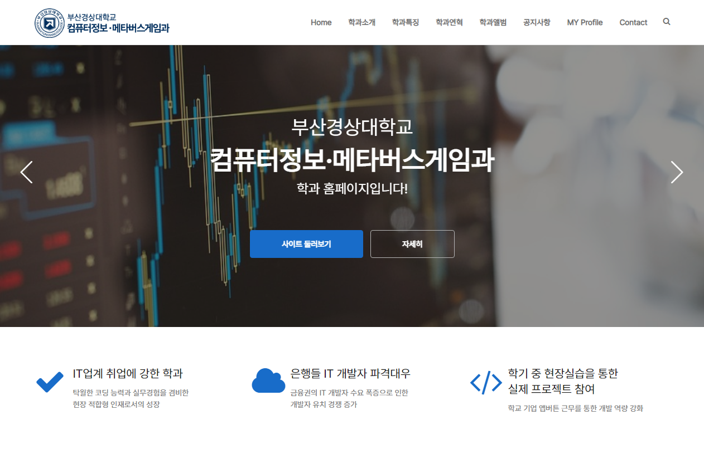
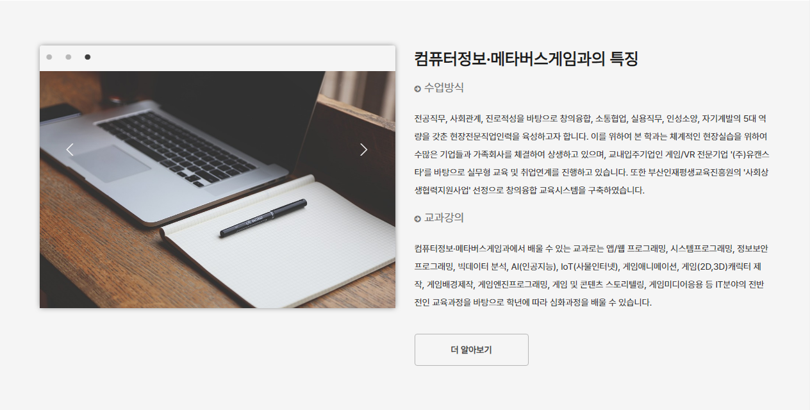
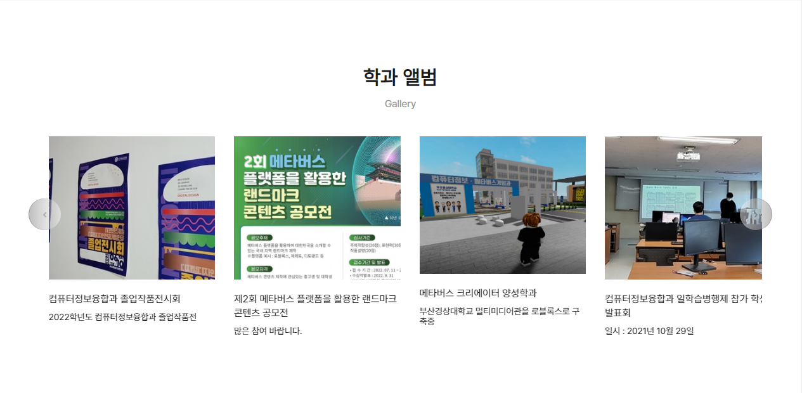
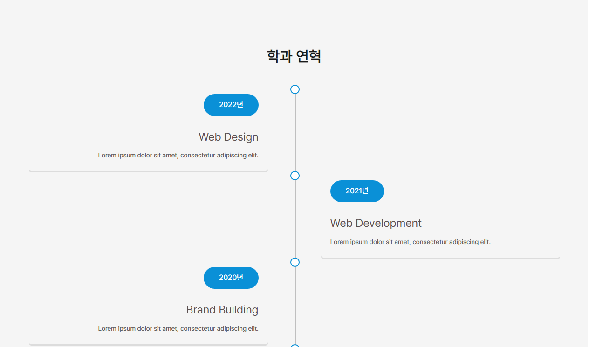
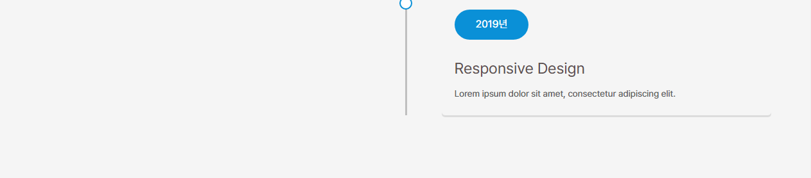
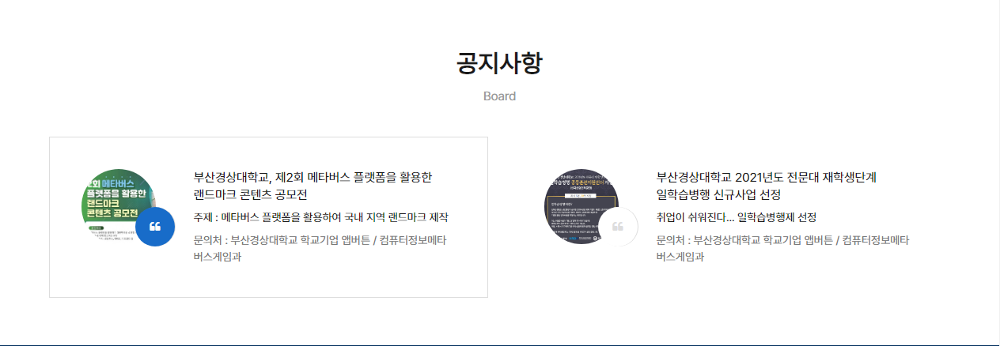
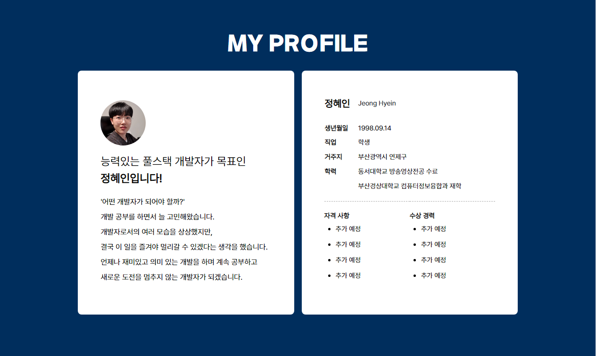
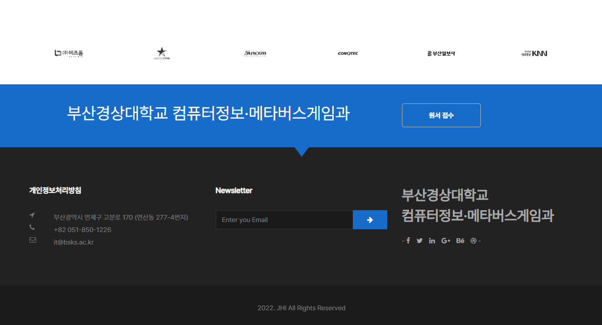

# 🙋‍♀️ Welcome To My BSKS-IT-Website!

## 👩‍💻 Personal Info
- Jeong Hyein
- gpdls6357@gmail.com

## 🔨 Technology Stacks
- Frontend : 

<!-- 

  -->
- Backend : 

<!-- - Mobile App :  
- Deployment : 

  -->
- Version Control : 

- And what else I can do is... : 

<!-- - Communication : 

  -->

## ✏️ Blog For Learning - <a href="https://jhi1234.github.io/">Here</a>

## 📝 Portfolio Website - <a href="https://jhi1234.github.io/myportfolio//">Here(Github)</a> or <a href="https://jhi-portfolio.netlify.app/">Here(Netlify)</a>
##### 강의 과제로 제작된 개인 포트폴리오 사이트입니다. 인적사항, 기술 스택, 경력, 진행 프로젝트 등을 나타내는 페이지를 제작하였습니다.

## 🏢 BSKS-IT-TEMPPAGE - <a href="https://jhi1234.github.io/bsks-it-temppage/">Here(Github)</a> or <a href="https://bsks-it-tempage.netlify.app/">Here(Netlify)</a>
#### 강의과제로 제작된 학과 홈페이지 사이트입니다. BootStrap 템플릿을 활용하여 학과 소개, 특징, 연혁, 앨범, 공지사항 등을 한 눈에 볼 수 있도록 제작되었습니다.

##### - 메인페이지 & 학과소개

##### - 학과특징

##### - 학과앨범

##### - 학과연혁

##### - 공지사항

##### - profile

##### - Footer

출처 - <a href="https://bootstrapthemes.co/item/made-agency-portfolio-free-bootstrap-template/">https://bootstrapthemes.co/item/made-agency-portfolio-free-bootstrap-template/</a>

